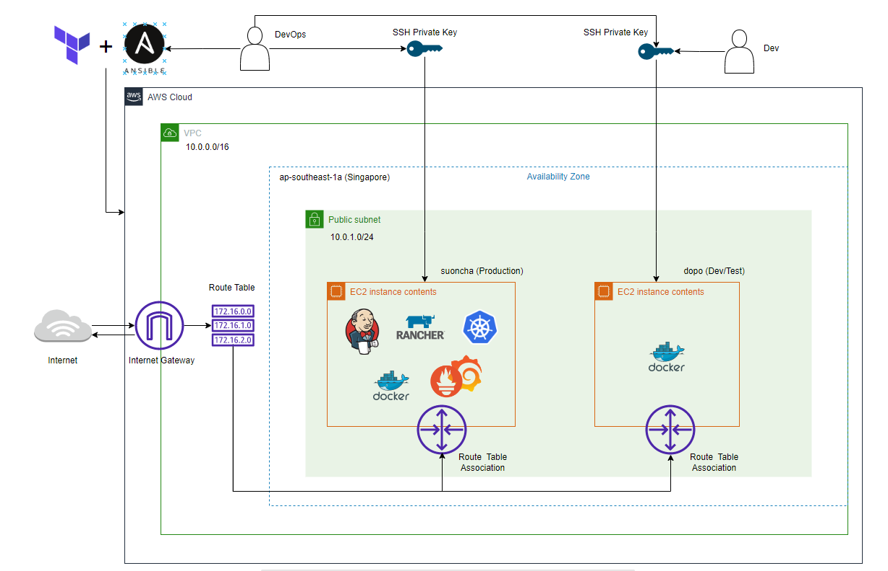

# AWS Architecture in VPC Creation with Terraform + Ansible
We are a team of 7, in need of a minimal but scalable system for future product development. This project will create a simple VCP with Internet Gateway, a public subnet which act as proxy servers.

From there Terraform will deploy a main EC2 instance (suoncha) and a secondary EC2 instance (dopo) in the public subnet, both can be connect to and from the internet. 

An SSH key pair is dynamically generated for each instance, but developers only has access to the secondary one, using it for development/testing/learning purpose. Only devops (me) has access to the main one.

Ansible is used for installing Docker & Nginx for both instance. The main instance will also host many tools for the team like Jenkins for CI/CD, Rancher for K8S Management, Prometheus & Grafana for Monitoring, ... which can be accessed via subdomains.

## Architecture diagram

## Current state

Modules:

- ssh: Generates an ssh key pair, save the private one as a local .pem file.
- networking: Sets up a VPC.
- ec2: Sets up EC2 instances.

How to run:

- UPDATE: I changed the approach to run, now you can run this on both Windows/Linux without changing the code
- terraform init
- terraform apply -auto-aprrove => This will create defined resources, .pem files to use for SSH and .ini files for Ansible
- (Linux/WSL only) ./ansible.sh (If you're using WSL, be sure that this repo is in a Linux-based directory)

## Inputs

| Name | Description | Type | Default | Required |
|------|-------------|------|---------|:--------:|
| region | AWS region - Default set to Singapore due to our team location  | `string` | `"ap-southeast-1"` | no |

## Outputs

| Name | Description |
|------|-------------|
| suoncha\_ip | IP of Main Server (Production) |
| dopo\_ip | IP of Secondary Server (Development) |
